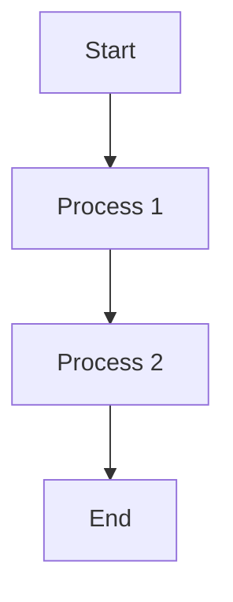
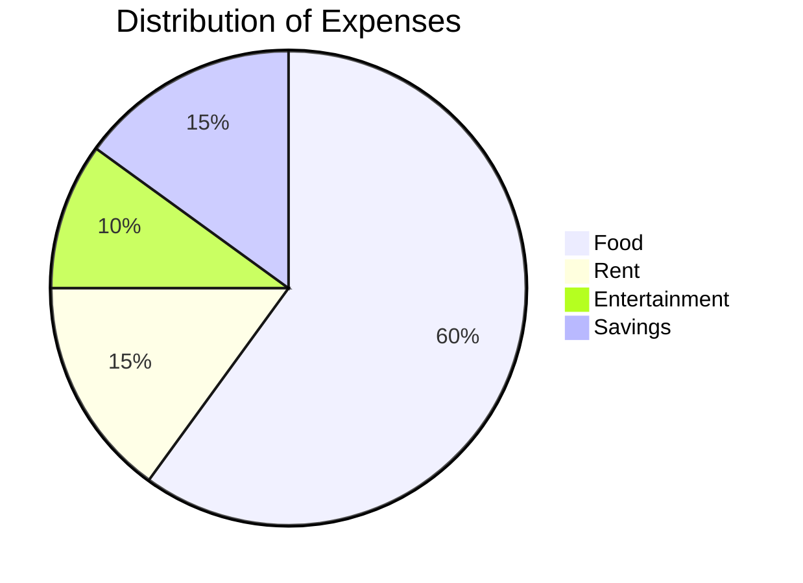

# documentation-aap

Here is a simple flow chart:

```mermaid
graph TD;
    A-->B;
    A-->C;
    B-->D;
    C-->D;
```

```mermaid
flowchart TD;
    A[Start] --> B[Process 1];
    B --> C[Process 2];
    C --> D[End];
```

```mermaid
pie
    title Distribution of Expenses
    "Food" : 60
    "Rent" : 15
    "Entertainment" : 10
    "Savings" : 15
```
