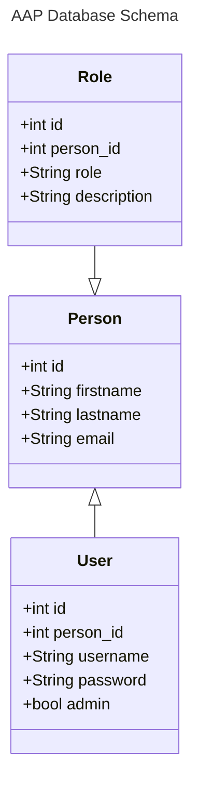
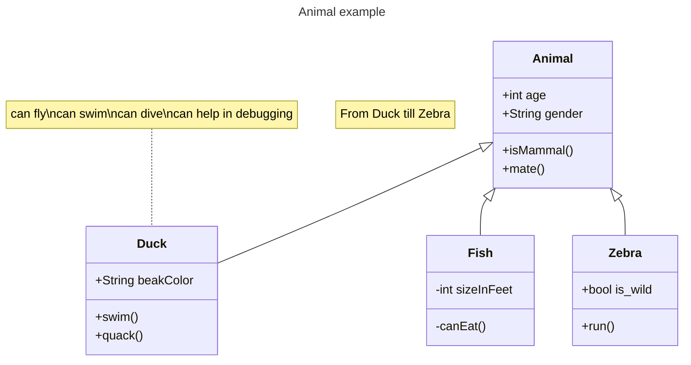

```mermaid
---
title: AAP Database Schema
---
classDiagram
    Person <|-- User
    Role --|> Person
    class User {
        +int id
        +int person_id
        +String username
        +String password
        +bool admin
    }
    class Person {
        +int id
        +String firstname
        +String lastname
        +String email
    }
    class Role {
        +int id
        +int person_id
        +String role
        +String description
    }
```

```mermaid
---
title: Animal example
---
classDiagram
    note "From Duck till Zebra"
    Animal <|-- Duck
    note for Duck "can fly\ncan swim\ncan dive\ncan help in debugging"
    Animal <|-- Fish
    Animal <|-- Zebra
    Animal : +int age
    Animal : +String gender
    Animal: +isMammal()
    Animal: +mate()
    class Duck{
        +String beakColor
        +swim()
        +quack()
    }
    class Fish{
        -int sizeInFeet
        -canEat()
    }
    class Zebra{
        +bool is_wild
        +run()
    }
```
