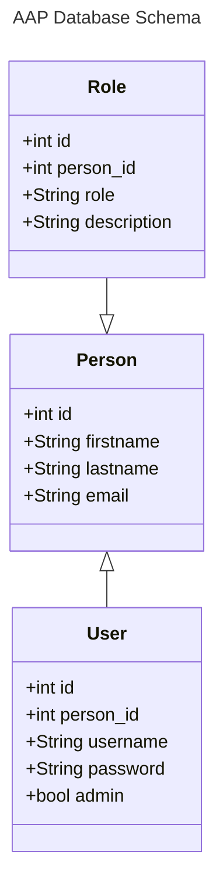

```mermaid
---
title: AAP Database Schema
---
classDiagram
    Person <|-- User
    Role --|> Person
    class User {
        +int id
        +int person_id
        +String username
        +String password
        +bool admin
    }
    class Person {
        +int id
        +String firstname
        +String lastname
        +String email
    }
    class Role {
        +int id
        +int person_id
        +String role
        +String description
    }
```
